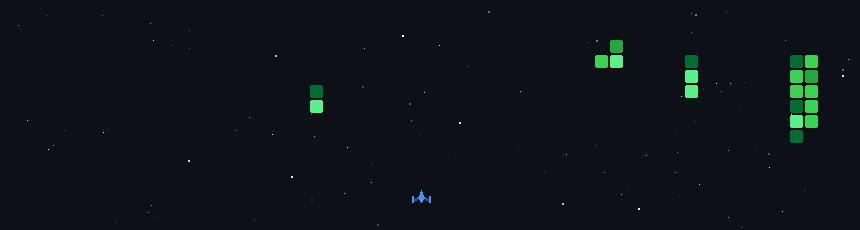



  

    <!-- Left: Vader GIF -->
    

      
    

    
    <!-- Middle: Vertical Divider -->
    

      
    

    
    <!-- Right: Header Content -->
    

      
      
<strong>Software & a Full Stack Developer</strong>

      
      

        
        
        
      

    

  

 

  

    

      <code>Frontend</code>  
      
    

    

      <code>Backend</code>  
      
    

    

      <code>Data</code>  
      
    

    

      <code>Ops</code>  
      
    

  

 

 

  

 

<a href="https://git.io/typing-svg">
;May+the+force+be+with+you." alt="Typing SVG" />
</a>

